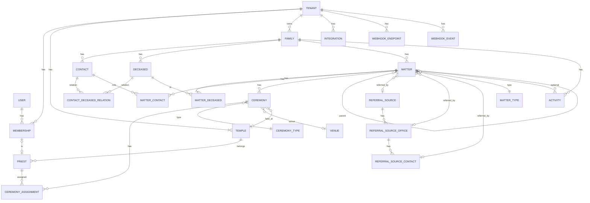

# tencle 要件定義・アーキテクチャ設計

寺院向けCRM `tencle` のMVPの要件と設計。

> 状態：Go 版（[ADR 0002](adr/0002-rebuild-in-go.md)）。最終決定ではない。
>
> 本書は要件と設計の**背景**を書く。次のものは本書ではなく、それぞれの文書を正とし、本書からは参照だけにする。
>
> - 不変条件とその中身を決める一覧（例外、許可項目、監査対象など）：[`architecture/invariants.md`](architecture/invariants.md)
> - 用語・識別子・ステータスの値：[`domain/glossary.md`](domain/glossary.md)
> - プロセス（AIの役割、レビュー、停止条件、高リスクの範囲、CI、ruleset、監査）：[`process/workflow.md`](process/workflow.md)
> - 実装規約・書き方：[`../AGENTS.md`](../AGENTS.md)
>
> 確定した設計判断は [ADR](adr/README.md) に記録する。

## 1. 文書の目的

本書は、寺院業務向けCRMのMVP開発において、後から変更すると影響範囲が大きい要件・設計判断のみを整理したものである。

細かなUI、一覧列、フォーム配置、表示文言、個別の入力補助などは本書の対象外とし、実装時に決定する。

### 1.1 プロジェクトの位置付け

- 個人の趣味・学習プロジェクトとして開発する。実運用は強く想定しないが、設計・運用は実運用に耐える水準を目指す
- 1人開発。AIを積極的に活用する
- 追加のランニングコストは極力かけない（無料〜数百円/月を目安）
- プロジェクト名・リポジトリ名・アプリ名は `tencle` とする

### 1.2 ADRで決定する事項

本書と不変条件で方針のみ定め、詳細をADRで決定するもの。

- RLSの実現方式の詳細（`db.TenantTx`、例外関数、DBロール）（§4.3）
- セッションとパスワードの方式（§5）
- 招待・パスワード再設定トークンの発行方法（§5.1）
- Actorの保存方式（§5.5）
- 監査ログの実装（DBのトリガーか、アプリ層か）（§10）
- Webhookの署名用シークレットの保存方法（§13）
- メール送信サービス（§14）
- デプロイ方式、GHCRのイメージ公開範囲、本番イメージの attestation の検証方法（§16.4）
- 定期Health Checkの方式（§17.1）
- 消去台帳の保存方法と、復元の手順（§11.2、§15.3）
- 移行の互換性を検査する方法（§16.4）
- ruleset を一時的に緩める緊急時の手順（[workflow.md](process/workflow.md#ruleset)）

### 1.3 実装で確かめる項目

机上で詰めるより、実際に動かして決める方が確かなもの。M1 の最初の縦断の実装（§22）または該当する機能の実装前のADRで決める。未決であること自体は欠陥とは扱わないが、該当部分の実装より前に決める。

| 項目 | 確かめること | 時期 |
|---|---|---|
| テナント作成用ロールの権限 | `INSERT ... RETURNING` に要る `SELECT`、既存Userのメールとの重なりの確認、冪等にする判定、監査ログへの書き込み。最初のadminのパスワードは招待のトークンで設定する | M1 |
| 既存Userの招待の受諾 | 既にUserを持つ人が別テナントの招待を受ける流れ（ログインしてから受諾する等）と、Membershipを作るときのActor | M1 |
| ユーザー単位の出来事の監査先 | パスワードの変更・再設定など、テナントに属さない出来事をどこに記録するか（I-4 との両立） | M1 |
| ジョブのエラー記録 | River はジョブの行にエラーを保存するので、エラーに個人情報が入らないようにする方法と、そのテスト（I-19・I-20） | M1 |
| 冪等性の「処理中」の扱い | 同じトランザクションで確定する方式で、処理中の再送に409を返す方法（アドバイザリロック等）。無理なら409をやめる | M3の前 |
| 消去の同時実行と台帳の形 | 消去と業務操作が同時に走ったときのロックまたは「消去中」の印、台帳に持たせる粒度（行IDと列名など）、書き込みの順序（意図の記録→DB→完了）、R2 の bucket lock で台帳の上書き・削除を拒否する設定（保持期間・対象のプレフィックス）と、台帳の書き込み用の資格情報をバックアップ用から分ける方法（I-45）、消去用ロールを保守用から分けるか、別Familyへの二重登録の見つけ方 | M2の前 |
| 移行の版の扱い | 旧版に戻した後に、新しい版の引数のジョブや `schema_version` をどう扱うか（保留・破棄）、新しい版の書き込みを始める時期、「旧版を戻す期間」の長さ、マイグレーションを実行するコンテナと認証情報 | M1b |

---

## 2. プロダクト概要

### 2.1 背景

寺院が葬儀社から案件を受け、自寺の僧侶または提携寺院の僧侶を葬儀・法要へ派遣する業務を管理する。

将来的には、自寺専用システムではなく、複数の利用者が使えるSaaSへ発展させる。

### 2.2 MVPの目的

MVPでは、まず以下を確実に管理できることを目標とする。

- 紹介元から受けた案件の登録
- 家族の管理
- 家族に紐づく複数の故人の管理
- 故人に紐づく案件の管理
- 案件に紐づく複数の葬儀・法要予定の管理
- 葬儀・法要への僧侶割り当て
- 案件ごとの対応履歴・変更履歴の管理
- 検索・絞り込みによる案件参照
- 僧侶が自分の確定済み予定を確認する「自分の担当」（最小限の一覧・詳細）

### 2.3 MVPで対象外とする主な機能

以下は将来フェーズで検討する。

- 49日法要などの営業タスク自動生成
- 獲得率・営業分析
- 提携寺院への打診（メール・LINE）と応募・採用フロー（設計方針のみ §6.14 で定める）
- 「自分の担当」の拡張（カレンダー表示、通知など）
- 僧侶スケジュール・カレンダー
- 会計・お布施・紹介料・僧侶への支払管理
- CSVインポート・エクスポート
- ファイル添付
- 高度なダッシュボード
- GraphQL API
- 外部エラー監視サービス
- 専用Staging環境
- SaaS課金機能

REST API・Webhookは、データ設計（Integration・Outbox・冪等性）をMVPで行い、外部公開は M3 とする（§22）。

---

## 3. 技術スタック

### 3.1 アプリケーション

- Go（`go.mod` で版を固定する）
- 標準の `net/http`（ルーティングを含む）
- templ + htmx（画面。§18）
- PostgreSQL、pgx v5、sqlc
- goose（マイグレーション）、squawk（マイグレーションの検査）
- River（PostgreSQLを使うジョブキュー）
- `log/slog`（構造化ログ）

依存は少なく保ち、標準ライブラリで足りるものに依存を追加しない。10年保守する前提では、依存の数がそのまま保守の費用になるためである。

### 3.2 アーキテクチャ方針

単一のGoのバイナリで構成するモジュラーモノリスとする。マイクロサービス化は行わない。

```text
tencle（1つのバイナリ）
├─ 画面（templ + htmx）
├─ REST API（M3）
├─ ジョブ（River。メール送信、Webhook送信）
├─ CLI（setup、create-tenant、消去）
├─ モジュール（ユースケース・ドメイン・ストア）
└─ PostgreSQL
```

Webhookは**送信のみ**とする。外部からのWebhook受信はMVPでは扱わない。

業務ロジックは画面・APIのハンドラへ書かず、モジュールのユースケースに置く（I-23）。ハンドラ・ジョブ・CLIはユースケースを呼ぶだけとする。認可を決めるコードは `internal/authz/**` にだけ置く（I-42）。認可の変更を1か所に集めることで、人間が読む範囲を小さくし、変更を機械的に検出できるようにするためである。

```text
画面 / REST API / ジョブ / CLI
      ↓
  ユースケース（認可 → 業務ロジック）
      ↓
  ストア（sqlc）
      ↓
 PostgreSQL（RLS）
```

#### モジュールの分け方

- **モジュールはトランザクションの境界で分ける。** 業務操作（§6.15）で同じ行ロックを共有するもの（Matter・Ceremony・CeremonyAssignment・MatterDeceased・MatterContact）は同じモジュールに置く。細かく分けると、モジュール間の整合性を自作することになるためである。最初は大きめに分け、分ける理由ができてから分ける
- **書き込みは、テーブルを所有するモジュールだけが行う。** 一覧や検索のように複数のモジュールのテーブルを結合する読み取りは、読み取り専用の `query` モジュールで行う
- **モジュール間の呼び出しは同期的に行う。** 相手の公開パッケージの関数を呼び、1つの業務操作の中では同じトランザクションを渡す。非同期の処理はジョブ（River）だけとし、プロセス内のイベントバスは使わない。業務の変更・監査・WebhookEventを同じトランザクションで確定するためである（I-44）
- **境界は機械で守る。** モジュールの実装は `internal/<モジュール>/internal/**` に置き、他のモジュールから見えないようにする（Go の `internal` の規則をコンパイラが強制する）。それで表せない規則（I-23・I-37・I-42 など）は自作の静的解析で検査する
- モジュールの中は、ドメイン（DBに依存しない型と規則）・ユースケース・ストア（sqlc）を基本とする。実装が1つしかないインターフェースは作らない（[AGENTS.md](../AGENTS.md)）

```text
cmd/tencle/          エントリポイント（serve・setup・create-tenant など）。依存は main で手で配線する
internal/
  platform/          DB（TenantTx・RLS）、HTTPの共通処理、ログ、時計、ジョブ基盤
  authz/             認可（I-42）
  identity/          User・Membership・認証・招待・セッション
  tenancy/           Tenant の作成
  directory/         Temple・Priest・紹介元・Venue・種別マスタ・共通マスタ
  crm/               Family・Contact・Deceased・Activity
  matter/            Matter・Ceremony・CeremonyAssignment・採番・業務操作
  audit/             監査ログ
  erasure/           Privacy Erasure と消去台帳
  integration/       Integration・APIキー・Webhook（M3）
  query/             モジュールをまたぐ読み取り（一覧・検索）
  web/               画面のハンドラとテンプレート（薄く保つ）
  api/               REST API（M3）
db/migrations/       マイグレーション（SQL）
tools/lint/          自作の静的解析
```

モジュールの一覧は目安であり、実装しながら決める。変えるときはこの節を更新する。

---

## 4. SaaS・マルチテナント設計

### 4.1 Tenant と Temple

`Tenant` をSaaS上の契約テナントとし、データの境界とする。

寺院は `Tenant` とは別に、テナントに属する `Temple` として管理する（§6.10）。自寺も提携寺院も `Temple` である。

```text
Tenant（契約テナント。データの境界）
└─ Temple
   ├─ 自寺（own）       テナントにちょうど1つ（I-27）
   └─ 提携寺院（partner） 複数
```

- テナントと寺院を分けることで、寺院単位の依頼（打診）を自然に表現でき、将来寺院以外がテナントになる場合にも対応できる
- MVPでは1テナントのみを利用するが、最初から複数テナント対応のデータモデルとする

### 4.2 テナント分離

主要な業務データは `tenant_id` を持つ共有DB・共有テーブル方式とする。

テナント境界は以下の二重防御で守る。

1. アプリ層：テナント文脈を設定するトランザクション（`db.TenantTx`）と `tenant_id` で絞るクエリ、`internal/authz` による認可
2. PostgreSQL Row Level Security（RLS）

RLSは第二の防御であり、唯一の防御にしない。無効化・迂回もしない。他テナントのデータへアクセスできないことを最重要テスト対象とする。

### 4.3 RLSの実現方式（ADR対象）

ルールは I-1〜I-3・I-34、[テナント所有の範囲](architecture/invariants.md#テナント所有の範囲)、[DBロール](architecture/invariants.md#dbロール)、[例外関数](architecture/invariants.md#例外関数)を正とする。ここでは設計の理由を書く。

- **トランザクション単位の設定にする理由**：コネクションプールで接続が使い回されるため、接続単位の設定は次の利用者に漏れる。`SET LOCAL`（`set_config(..., true)`）はトランザクション内でしか効かないので、読み取りも含めてトランザクション内で実行する必要がある。そこで、テナント所有データへのクエリは、トランザクションを開いてテナント文脈を設定する関数（`db.TenantTx`）の中でだけ実行できる形にする
- **ロールを分ける理由**：`FORCE ROW LEVEL SECURITY` はテーブル所有者にもRLSをかけるため、マイグレーション・バックアップ・例外関数には `BYPASSRLS` を持つ専用のロールが要る。アプリの実行環境には、それらの認証情報を置かない
- **テストをアプリ用ロールで実行する理由**：スーパーユーザー接続ではRLSがバイパスされ、テストが何も検証しなくなるため
- **例外をDB関数にする理由**：テナントを確定する前に必要な照合だけを、返す列を限って許すため。RLSを迂回する汎用の接続をアプリに持たせない
- **テナントをまたぐ定期処理**：テナントIDの列挙（例外）から、1テナントずつジョブを作る

### 4.4 User / Membership

ユーザーアカウントとテナント所属を分離する。

```text
User
└─ Membership
   ├─ Tenant
   ├─ access_level   admin | office | priest（§5.2）
   └─ active
```

- `User` はシステム全体で一意で、同一Userが複数Tenantへ所属可能
- 権限はMembership単位
- 複数テナントへ所属するユーザーは、現在操作するテナントを明示的に選択する
- URLにTenant slugを含める（`/t/{tenant_slug}/matters`）。slugは原則変更不可
- テナントはURLから決定し、リクエストボディからは取らない（I-5）

### 4.5 ルートの種類

ルートの種類と、種類ごとの否定テストは[不変条件](architecture/invariants.md#ルートの種類と否定テスト)を正とする。公開、認証、ログイン済み（テナントなし）、テナント、打診（将来）、API（M3）、開発専用の7種類がある。

---

## 5. 認証・認可

認証は自作する（パスワードのハッシュは `golang.org/x/crypto` の argon2id）。ライブラリの前提に合わせる必要がなく、例外関数・RLS と組み合わせやすいためである。セキュリティ上重要なので、認証のコードは高リスクとして扱う。

### 5.1 アカウント作成

一般公開サインアップは行わない。

- テナントはCLIから、アプリとは別のテナント作成用ロールで作成する。Tenant・自寺のTemple・最初のadmin・標準の種別マスタを1つのトランザクションで作る（I-31）
- 招待の受諾でのUserの作成、認証トークンの保存・照合・消費は、[例外関数](architecture/invariants.md#例外関数)で行う。パスワードの検証はアプリ側で行う
- 以後の職員はadminからの招待制とする
- 招待メールとパスワード再設定メールを送る。トークンは送信ジョブの中で発行し、ハッシュだけを保存する（I-10）
- 招待やパスワード再設定の応答は、ユーザーの存在有無で変えない（I-34）

adminの二要素認証は将来検討する。

### 5.2 権限の段階

Membershipは権限の段階（`access_level`）を1つ持つ。上位の段階は下位の権限をすべて含む（I-6）。

```text
admin ⊃ office ⊃ priest
```

| 段階 | できること |
|---|---|
| `admin` | officeのすべて ＋ 職員管理、マスタ管理、テナント設定、ステータスの例外修正（理由必須） |
| `office` | 案件の受付・登録・参照・編集（テナント内の全業務データ） |
| `priest` | 「自分の担当」（§5.3）のみ |

「僧侶として割り当てられるか」は権限の段階とは別に、`Priest.membership_id` による紐付けで表す（§6.10）。

```text
A僧侶（受付もし、派遣もされる）   access_level = office ＋ Priestに紐付け
B僧侶（派遣のみ）                 access_level = priest ＋ Priestに紐付け
```

- `priest` の段階で招待する場合は、招待時に紐付ける自寺のPriestを指定し、受諾時にMembershipの作成とPriestへの紐付けを同じトランザクションで行う（I-28）
- テナントには有効なadminが常に1人以上いる（I-31）

### 5.3 「自分の担当」

Priestに紐付いたMembershipは、段階にかかわらず「自分の担当」を参照できる。範囲と許可項目は I-7 と[「自分の担当」の許可項目](architecture/invariants.md#自分の担当の許可項目)を正とする。

予定日時を過ぎても儀式が完了登録されるまでは「自分の担当」に残る。儀式を自動では完了にしないためである。

MVPでは最小限の一覧・詳細を提供する。カレンダー表示や通知は将来とする。

### 5.4 職員の無効化・権限変更・セッション

退職職員は削除せずMembershipを無効化する。過去の案件・監査ログ・Activityに残る操作者情報との整合性を維持する。無効化・権限の変更・パスワードの変更が即座に効くことは I-8 を正とする。

### 5.5 操作者（Actor）

書き込みを行う主体は Membership（職員）、Integration（外部API）、System（ジョブ・CLI）の3種類とする。監査ログ・Activityの作成者・登録者等の「誰が」はUserではなくActorで表す（I-4）。System Actorを作れるモジュールは限定する（I-37）。

Actorの保存方式（種類ごとの参照列を持つか等）はADRで決める。

---

## 6. 主要ドメインモデル

識別子とステータスの値は[用語集](domain/glossary.md)を正とする。

### 6.1 概要



宗派（Sect）はTemple / Priestと多対多（図では省略）。

同じFamilyの中だけで結ぶ関係は I-29 を正とする。

### 6.2 Family

家族をCRM上の顧客単位とする。

- 家族名は任意
- 現在住所を保持
- 家族全体の備考を保持
- 主連絡先（Contact）を1人設定可能。families の `(tenant_id, id, primary_contact_id)` から contacts の `(tenant_id, family_id, id)` を参照する複合外部キーで、同じFamilyのContactに限る。FamilyとContactが相互に参照するため遅延制約とする
- アーカイブ可能
- 宗派は持たない（I-22）

### 6.3 Contact

Familyに所属する生存者・連絡先人物。

- 姓・名を分離
- 姓かな・名かなを分離
- 複数電話番号
- 複数メールアドレス
- 個別住所を任意で保持（別居の家族も同じFamilyの連絡先人物として登録できる）
- 営業案内をしない `do_not_contact` を保持

故人との続柄は中間テーブル `ContactDeceasedRelation` で管理する。

案件内での役割（喪主、施主、案件連絡先）は中間テーブル `MatterContact` で管理し、故人との続柄と分離する。

- 案件関係者は、その案件と同じFamilyのContactに限る
- 同じ人が2つの家族に関係する場合は、それぞれの家族に登録する（重複候補の警告は出る）
- この制約は、実運用で困った場合に緩める

### 6.4 Deceased

Familyに複数の故人を紐付け可能とする。

主要情報：

- 姓・名
- 姓かな・名かな
- 生年月日（`date`、不明を許容）
- 命日（`date`）
- 戒名・法名・法号等を表す中立的な項目
- 享年・行年（計算値。§6.4.1）
- 宗派
- 備考
- 元の連絡先人物（`former_contact_id`。任意）：生存者として登録していた人が亡くなった場合に、同じ人物であることを対応付ける

命日は将来の49日・年忌法要計算の基準として利用する。

#### 6.4.1 享年・行年

数え方は宗派よりも地域・寺院・時代によって異なるため、原則として保存せず計算で求める。

- 表示する値は、手入力値があればそれを、なければ生年月日と命日から計算した値とする
- 計算方法
  - 満年齢（`man`）：通常の年齢計算
  - 数え年（`kazoe`）：`命日の年 − 生年 + 1`（新暦で計算する）
- Tenantの設定として、既定の数え方（`age_reckoning`）と表記（`age_label`）を持つ
- Deceasedは手入力値 `age_at_death_override` と、その値の数え方 `age_at_death_override_reckoning` を任意で持つ。計算と異なる扱いが必要な場合や、生年月日が不明な場合に使う。手入力値の数え方は、表示の際に「数え」「満」を併記するために使う
- 生年月日が不明で手入力値もない場合は、年齢を表示しない

Tenantの設定を後から変えると、手入力値のない故人の表示はすべて新しい設定で再計算される。過去の表記を固定したい場合は手入力値を使う。

### 6.5 Matter

紹介元から受けた「仕事・受注」の単位。

原則：

- 1 Matter = 1 Family（通常の編集ではFamilyを変更できない。訂正の方針は §6.16）
- 1 Matter = 1人以上のDeceased（`MatterDeceased`、§6.6）
- 1 Deceased = 複数Matter
- 葬儀案件と49日法要案件は別Matter
- 後続案件は `parent_matter_id` で親子関係を持つ
- 1 Matter = 複数Ceremony
- Ceremonyが0件でも登録できる（仮登録。キャンセルしていなければステータスは「受付中」）

主な概念：

- 自社案件番号
- 紹介元外部案件番号
- 案件種別
- 獲得経路
- 紹介元・支店・担当者
- 受付日時
- 受付担当者
- 登録者
- 現在の担当職員
- ステータス（導出。§6.8）
- 親Matter
- 宗派上書き
- キャンセル情報（`cancelled_at`、理由）

宗派は「Matterの宗派上書き → 主となる故人の宗派」の順で決定する。

#### 獲得経路と紹介元

- 獲得経路が紹介の場合、Matterは紹介元を持つ。仮登録中は空を許す。支店・担当者は任意で持つ
- 獲得経路が直接依頼の場合、紹介元は空とする
- 紹介元・支店・担当者の整合性は I-41 を正とする

#### 案件番号

自社案件番号はTenant単位・年単位で採番する（例：`2026-000001`）。ルールは I-11 を正とする。

- 採番は `(tenant_id, year)` をキーとするカウンタテーブルで `INSERT ... ON CONFLICT DO UPDATE ... RETURNING` により行い、同時実行でも重複しない

### 6.6 MatterDeceased

MatterとDeceasedの中間テーブル。

```text
MatterDeceased
├─ tenant_id
├─ matter_id
├─ family_id
├─ deceased_id
└─ primary      主となる故人
```

- 大半の案件は故人1人。合同法要等で複数人になる場合に対応する
- 制約と検証は I-13 を正とする
- 一覧表示は主となる故人を使う（例：「山田太郎 他1名」）

MVPの画面では故人を1人だけ選択する形とし、複数選択UIは必要になった時点で追加する。

### 6.7 Ceremony

Matter内で実際に僧侶が動く予定・実績の単位（例：通夜、葬儀、初七日、49日法要、納骨、その他法要）。

主な概念：

- CeremonyType
- 集合日時
- 開始日時
- 終了予定日時
- 完了日時
- ステータス（予定・完了・キャンセル）
- 実施場所（スナップショット。§6.12）
- 執り行った宗派（完了時に固定する。I-47）
- 僧侶割り当て

- 予定日時を過ぎたことだけでは自動完了にしない
- 遷移は `matter` モジュールの遷移表で制御する。戻しやMatterのキャンセルとの関係は I-14 と[業務操作](architecture/invariants.md#業務操作)を正とする

### 6.8 Matterステータス（導出）

Matterのステータスは保存せず、Ceremonyから導出する（I-12）。SQL（クエリ内の式またはビュー）で計算するため、一覧の絞り込み・並べ替えにも使える。

| 条件（上から優先） | Matterステータス |
|---|---|
| Matterがキャンセルされている | キャンセル |
| Ceremonyが0件 | 受付中 |
| 予定のCeremonyが1件以上ある | 進行中 |
| 残りが完了・キャンセルのみで、完了が1件以上 | 完了 |
| すべてキャンセル | キャンセル |

- Matterのキャンセルのみ、Matter自身に保持する（Ceremony 0件の仮登録のまま失注する場合があるため）
- Matterのキャンセル・取り消しとCeremonyの関係は[業務操作](architecture/invariants.md#業務操作)を正とする
- 「僧侶未割当」等はステータスではなく、案件詳細の「不足情報」として表示する

### 6.9 CeremonyAssignment

CeremonyとPriestの中間テーブル。1 Ceremonyに複数僧侶を割り当て可能。

- 役割：導師・脇導師
- ステータス：仮・確定・取消
- 同じ僧侶を同じCeremonyに二重に割り当てない（取消以外で `unique (ceremony_id, priest_id)`）
- 確定したときの僧侶の所属寺院を `temple_id` として固定する（I-47）。僧侶の所属が後で変わっても、過去の提携寺院別の実績は変わらない
- 「自分の担当」は確定を基準とする（§5.3）

### 6.10 Temple / Priest

寺院はテナントに属するマスタとして管理する。

```text
Temple
├─ tenant_id
├─ kind: own（自寺）| partner（提携寺院）
├─ 名称・住所
├─ 宗派（複数）
└─ 対応地域（複数）

Priest
├─ tenant_id
├─ temple_id        （必須）
├─ temple_kind      所属寺院のkindの写し（制約のため）
└─ membership_id    （nullable。自寺の僧侶のみ）
```

- 自寺はテナントにちょうど1つ（I-27）
- 僧侶はすべて、自寺か提携寺院のいずれかに所属する
- ログインアカウントと紐付けられるのは自寺の僧侶のみ（I-28）。テーブルをまたぐ条件をDBで保証するため、所属寺院の `kind` の写しを僧侶側に持ち、`temples (tenant_id, id, kind)` への複合外部キーとCHECK制約を組み合わせる
- 対応地域は都道府県・市区町村の共通マスタで管理する
- 将来のSaaS化で提携寺院が自らテナントになった場合は、Templeに対応するTenantへの参照を追加する

### 6.11 ReferralSource

紹介元は階層構造で管理する。

```text
ReferralSource
└─ ReferralSourceOffice
   └─ ReferralSourceContact
```

- 外部案件番号（`external_matter_number`）は紹介元と組み合わせて重複を防止する。`unique (tenant_id, referral_source_id, external_matter_number)` を、紹介元と外部案件番号の両方が入っている場合のみ適用する（部分一意インデックス）
- 仮登録時には未入力を許可する

### 6.12 Venue と実施場所

再利用価値のある会場だけをVenueマスタとして管理する（葬儀会館、火葬場、その他繰り返し利用する施設）。寺院はTempleマスタで管理するため、Venueには登録しない。個人宅もVenueマスタに登録しない。

Ceremonyの実施場所は以下を許可する。

- Temple（自寺・提携寺院）
- Venue
- Family住所
- 一時的なcustom場所

Ceremonyには当時の実施場所をスナップショット保存する（I-15）。

### 6.13 Activity

家族・案件への対応履歴。

```text
Activity
├─ family_id      必須
├─ matter_id      任意（同じFamilyのMatterに限る。I-29）
├─ author         Actor（§5.5）
├─ type
├─ body
├─ important
├─ occurred_at
├─ voided_at      取消日時
└─ void_reason    取消理由
```

- 案件化前の問い合わせもFamily単位で記録可能
- 本文はMVPではプレーンテキストとする
- 編集できる。変更前の値は監査ログに残る
- 削除はできない。理由付きで取り消し、通常の表示から外す（I-30）
- 個人情報の消去は取消とは別に、Privacy Erasure（§11.2）で行う

### 6.14 提携寺院への打診（将来。設計方針のみ）

確定案件の一覧とは**別の入口・別の情報範囲**として設計する。

```text
Ceremony
└─ TempleRequest（打診。儀式×提携寺院ごとに1件）
   ├─ Temple（kind = partner）
   ├─ status
   ├─ token_hash
   ├─ expires_at
   └─ 採用時に CeremonyAssignment を作成
```

MVPで決めておくこと：

- 打診は寺院単位で行う
- 打診はCeremonyAssignmentとは別のエンティティとし、採用されて初めてAssignmentを作る
- テナント外へ見せる項目は[不変条件](architecture/invariants.md#テナント外に見せる項目)に限る（I-9）
- 打診リンク（`/temple-requests/{token}`）はログイン不要。トークンはハッシュ保存・有効期限付き・無効化可能

打診フェーズで決めること：

- 採用方式（先着か、寺院側が選考するか）
- 応募後・採否前・不採用・期限切れの各段階で見せる項目
- 地域の粒度（小さな自治体で故人を特定できないようにする）
- 提携寺院の僧侶が確定後に詳細を見る方法
- LINE・メール送信（ジョブで非同期化）

### 6.15 業務操作と整合性

複数のエンティティにまたがる変更（Matterのキャンセルと取り消し、Ceremonyの追加・完了・再開、主となる故人の差し替え、割り当ての確定など）は、決めた業務操作としてだけ行う。操作の一覧、ロックの規約、並行したときの期待する結果は I-44 と[業務操作](architecture/invariants.md#業務操作)を正とする。

- **理由**：PostgreSQLの Read Committed では、トランザクションで包むだけでは複数の処理の読み取りと判断が直列化されない。状態機械を個別のエンティティに置くだけでは、エンティティ間の整合性は決まらない。そこで、Matterの行を先にロックしてから子を読み・判断し・変更する規約にする
- 業務の変更・監査の記録・WebhookEvent・冪等性の記録は同じトランザクションで確定する
- 単独のエンティティの通常の編集は、更新版番号（`lock_version`）で上書きの競合を検出する
- 画面・API・ジョブのどこから呼んでも同じ業務操作を通るので、入口によって整合性が変わらない

### 6.16 Familyの訂正

Familyを恒久的な顧客のまとまりとして扱う。重複統合のUIはMVPでは作らないが、将来の訂正の方針を先に決めておく。

- 通常の編集では、Matter等の `family_id` を付け替えない（I-13）
- 誤った家族で作った案件は、取り消して正しい家族で作り直す
- 同じ家族の二重登録は、将来、adminだけが使える専用の統合操作で直す。統合操作は、すべての子の `family_id` を1つのトランザクションで付け替え、旧IDから新IDへの転送表と監査の記録を残す。案件番号と履歴は変えない
- 生存者として登録した人が亡くなった場合は、Deceasedを新しく作り、`former_contact_id` で同じ人物だと対応付ける。重複の判断と消去の範囲（§11.2）に使う

---

## 7. マスタ設計

### 7.1 システム共通マスタ

- 宗派
- 都道府県
- 市区町村
- 郵便番号データ

RLS対象外で、アプリ用ロールからは読み取り専用。更新は保守用ロールで、保守用コンテナのCLIから行う（[DBロール](architecture/invariants.md#dbロール)）。

### 7.2 テナント固有マスタ

- Temple（自寺・提携寺院）
- Priest
- MatterType
- CeremonyType
- ReferralSource
- ReferralSourceOffice
- ReferralSourceContact
- Venue

標準値はテナント作成時に自動投入する。

MatterType / CeremonyTypeは、表示名とは別に nullable の `system_code` を持つ（値は用語集で定める）。業務ロジック（将来の営業タスク生成等）はテナントが編集できる名前ではなく `system_code` に依存させる。

---

## 8. 検索・データ品質

### 8.1 検索

PostgreSQLを利用した検索をMVPで提供する。

主な検索対象：案件番号、外部案件番号、Family、Contact、Deceased、電話番号、ふりがな

部分一致には `pg_trgm` を用い、正規化済みカラムを検索対象とする。専用検索エンジンはMVPでは導入しない。

### 8.2 正規化

検索・重複判定のため、電話番号、メールアドレス、ふりがな、全角/半角、ひらがな/カタカナ、不要空白を正規化する。

### 8.3 重複防止

Family / Contact / Deceased等は重複候補を警告するが、登録自体は完全には禁止しない。MVPでは重複統合UIは作らない。

---

## 9. 日時・タイムゾーン

- 日時はUTCで保存する
- 業務タイムゾーンは `Asia/Tokyo` 固定とする
- 生年月日・命日は `date` 型とする
- 年単位の境界（案件番号の年等）はJSTで判定し、年末年始の境界をテストする

---

## 10. 監査・履歴

イベントソーシングは採用しない。現在状態は通常のRDBテーブルへ保存し、業務上重要なエンティティに監査ログを付与する。

- 監査対象と記録する内容は I-16 と[監査対象](architecture/invariants.md#監査対象)を正とする
- 記録内容：誰が（Actor）・いつ・何を・どの値からどの値へ変更したか（削除を含む）。秘密の値は記録せず、変わったことだけを記録する（I-35）
- 重要な変更履歴は画面から確認可能とする。読む権限は元のデータの権限に従う（I-35）
- 監査ログは追記のみとする（I-35）
- 監査ログの値に含まれる個人情報の扱いは §11.2 に従う

---

## 11. アーカイブと個人情報消去

### 11.1 Archive

業務上使わなくなったデータは原則アーカイブする。

- 通常検索では非表示
- 必要に応じてアーカイブ済みを表示可能
- 復元可能
- 一意制約はアーカイブ済みを除く部分インデックスとするか、テーブルごとに決める

### 11.2 Privacy Erasure

個人情報削除への対応はArchiveとは別概念とする。

- 通常検索にもアーカイブ検索にも出さない
- 復元不可
- PIIを削除または識別不能化
- 消去した事実のみ非PIIの監査記録として残す
- 消去の単位、対象範囲、消去中の扱いは I-18 と[消去の単位](architecture/invariants.md#消去の単位)を正とする。Family単位を基本とし、個人単位の依頼では構造化された項目を自動で消し、自由記述は候補を一覧にして人が確認する
- 個人情報をコピーして持つ項目（スナップショット等）は出所のIDを持ち、消去のときにたどれるようにする
- 消去の記録（消去台帳）はDBの外にも保存し、バックアップから復元した後に再適用する（I-45）。DBの中だけに記録すると、バックアップの後に行った消去を復元の後に知ることができないためである

MVPではPrivacy Erasureの管理画面を作らず、運用者（テナントのadminではない）がCLI等の安全な手段で対応する。

---

## 12. API設計

データ設計はMVPで行い、外部公開は M3 とする。

### 12.1 REST API

- `/api/v1/...`
- 普通のREST JSON。JSON:API準拠にはしない
- GraphQLは提供しない

```http
POST /api/v1/matters
GET /api/v1/matters/{matter_number}
```

外部APIはユースケースを呼び出す入口として実装し、業務ロジックをAPI層へ重複実装しない。

### 12.2 API認証

外部システムごとに `Integration` を作る。Integrationは安定した操作者（Actor）であり、APIキーはその子として複数持てる。

```text
Tenant
└─ Integration（操作者。鍵を替えても同じ）
   ├─ name
   ├─ permissions（許可する操作・項目）
   ├─ enabled
   └─ IntegrationKey（複数）
      ├─ key_hash
      ├─ expires_at
      ├─ revoked_at
      └─ last_used_at
```

- 鍵を複数持てるのは、新しい鍵と古い鍵を短い期間並べて、止めずに入れ替えるため。鍵を替えても、操作者の履歴と冪等性（Integration単位）は切れない
- APIキーはハッシュでのみ保存する（I-10）
- キーには接頭辞を付け、秘密情報スキャンで検出可能にする
- APIキーの照合は[例外関数](architecture/invariants.md#例外関数)で行い、テナントは検証したIntegrationから決める。クライアントの指定は使わない（I-5）
- 権限は、許可した操作・出力項目だけを認め、それ以外は拒否する（I-6）。Webhookの送信先の管理も権限の1つとする。権限の語彙はM3までに決める
- OAuth 2.0 / OIDCは採用しない

### 12.3 Idempotency

書き込みAPIには `Idempotency-Key` を採用する。

- 再送・指紋・処理中・再認可のルールは I-17 を正とする
- 指紋には、メソッド・ルートの型・対象・本文のハッシュを含める。同じキーを別の操作に使い回すことを防ぐためである
- 業務の変更と冪等性の記録を同時に確定し、確定の直後に接続が切れても再送で二重に作成しない
- 保存した応答を返す前に、現在の認可と消去の状態を確かめる。権限の縮小や消去の後に、見せてはいけない応答を返さないためである
- 冪等性の記録には有効期限を設け、期限切れの削除はテナントごとの定期ジョブで行う

業務上の重複防止である `external_matter_number` と、通信上の冪等性である `Idempotency-Key` は別の役割として扱う。

---

## 13. Webhook設計（送信）

データ設計はMVPで行い、外部公開は M3 とする。

### 13.1 モデル

「起きた事実」と「送信先ごとの配送」を分ける。

```text
Tenant
├─ WebhookEndpoint（送信先）
│  ├─ url
│  ├─ secret（署名用。保存方法はADRで決める。I-10）
│  ├─ event_types
│  └─ enabled
├─ WebhookEvent（起きた事実。1件）
│  ├─ event_id, event type, schema_version
│  ├─ 対象のIDとリビジョン
│  └─ occurred_at
└─ WebhookDelivery（WebhookEvent × WebhookEndpoint ごとの配送）
   ├─ 試行回数、次回の時刻、結果
   └─ 送信先の設定の版
```

- 1つのイベントを送信先Aには成功、Bには失敗、という状態を表せる。再送は失敗した送信先にだけ行う
- 送信先を後から追加しても、過去のイベントは送らない。URLの変更や無効化の後に残っている配送は、送信の時点の設定で送るか止めるかをADRで決める

### 13.2 ペイロードの契約

ペイロードは「通知」とし、ID・種類・リビジョン・`schema_version`・発生日時だけを含め、個人情報を含めない（I-48）。受信側は、通知を受けたら API で最新の状態を取得する。

- 配送順序を保証しないので、受信側がペイロードで状態を上書きする方式にすると、古いイベントが新しい状態を戻してしまう。通知にして最新の状態を取りに来てもらうことで、この問題を避ける
- ペイロードに個人情報がないので、消去の後に再送しても個人情報は出ない
- イベントと配送の保持期間はADRで決める

### 13.3 配送保証

- `at-least-once delivery` とする
- 全イベントに一意な `event_id` を付与し、受信側は `event_id` で冪等処理できる
- 配送順序は保証しない
- 本文のHMAC署名をHTTPヘッダーで渡す。シークレットは、新旧を短い期間並べて入れ替えられるようにする
- 最大リトライ回数を超えたものは失敗状態として残し、確認できるようにする

### 13.4 イベント永続化（Outbox）

```text
業務Action
↓
業務データ更新 + WebhookEvent・WebhookDelivery作成 + ジョブ投入（同一トランザクション。I-44）
↓
DB commit
↓
Riverで配送
↓
失敗時は再試行
```


---

## 14. バックグラウンド処理・メール

バックグラウンドジョブは River を標準とする。PostgreSQLだけで動き、業務のトランザクションの中でジョブを投入できるためである。Redis等の追加インフラは導入しない。

用途例：招待メール、パスワード再設定メール、Webhook配送、冪等性の記録の期限切れ削除、将来の営業タスク生成、将来の打診通知

- ジョブの引数とテナント文脈のルールは I-20 を正とする
- 共通マスタ（郵便番号データ等）の更新は、アプリのジョブではなく、保守用コンテナのCLIを定期実行して行う。アプリの実行環境に保守用ロールの認証情報を置かないためである

### 14.1 一括処理の原則

CSVの取り込みなどの一括処理は将来の機能だが、原則を先に決めておく。

- 1案件に対する業務操作は、原子的に行う（§6.15）
- 複数の案件にまたがる一括処理は、原則として案件ごとに確定し、途中で失敗しても成功した分は残す。再実行しても二重に処理しない
- 一括処理は `BulkOperation` として記録し、依頼者のActor、実行するActor、対象を確定した方法、項目ごとの結果、冪等キー、進捗を持つ。ジョブにはそのIDだけを渡す
- 利用者の依頼による処理は、処理の時点で依頼者の権限を確かめ、依頼者が無効化されたら止める（I-20）
- 定期保守の処理と利用者の依頼による処理を区別し、System Actor の権限は用途ごとに限定する（I-6）

メール送信サービスは、無料枠で招待・パスワード再設定をまかなえるものをADRで選ぶ。開発・テストでは送信せず、ローカルのメールボックス表示（開発専用ルート）で確認する。

---

## 15. インフラ・Docker

### 15.1 Docker前提

開発環境・本番環境ともDockerを前提とする。

```bash
git clone <repository>
cp .env.example .env
docker compose up
```

で開発環境を起動できること。

### 15.2 本番構成

国内レンタルVPS上で以下をDockerとして稼働させる。

```text
VPS
├─ Caddy
├─ tencle（Goのアプリケーション）
├─ PostgreSQL
├─ backup（cron。バックアップ用ロール）
└─ maintenance（cron。保守用ロール。共通マスタの更新）
```

- CaddyがHTTPSとReverse Proxyを担当する
- PostgreSQLは外部へ直接公開しない
- 本番のドメイン、VPSのIP、実際の設定値はリポジトリやワークフローのログに出さない（I-21）

### 15.3 DBバックアップ

VPS内だけでは障害時に失われるため、最初から外部へ退避する。

```text
pg_dump → restic → Cloudflare R2（S3互換API）
```

- `pg_dump` はバックアップ用ロールで行う（[DBロール](architecture/invariants.md#dbロール)）
- resticで暗号化・重複排除・世代管理（例：日次7世代、週次4世代）を行い、`restic forget --prune` で期限切れの世代を実際に削除する
- R2は無料枠内に収まる想定（保存10GB/月、送信無料）
- R2のAPIトークンは対象バケットのみに権限を限定する
- R2トークンとresticパスワードはVPSの `.env` で管理し、リポジトリに入れない
- resticパスワードはVPSの外（パスワードマネージャー等）にも保管する。VPSと一緒に失うとバックアップを復元できなくなるため
- マイグレーション実行前にもバックアップを取る
- リストア手順を文書化し、VPS上の別コンテナ・別DBに復元して確認し、確認後に破棄する。本番データを持ち出さないため、手元やCIでは行わない（I-21）
- 復旧目標は、RPO（失ってよい更新の量）24時間、RTO（復旧までにかかってよい時間）48時間とする。日次のバックアップで満たせる。より短くする場合は、WALアーカイブ（R2へ）を検討する
- 復元は、Webを公開せず、ジョブのキューと外部への送信（メール・Webhook）を止めた状態で行い、I-45 の手順（消去台帳の再適用、全セッション・未消費トークン・APIキーの失効、古い未実行ジョブの破棄または確認など）を終えてから公開する。DBを過去に戻すと、バックアップの後に行った失効や消去も元に戻り、外部へ送ったメールやWebhookは戻らないためである
- リストア試験では、「バックアップ → 消去・パスワード変更・APIキーの失効 → DB喪失 → 復元」の順序も試し、消去した情報が閲覧・送信されず、失効したものが使えないことを確かめる。外部サービスを呼ばない設定で行う

---

## 16. GitHub・CI/CD

### 16.1 Repository

- GitHubを最初から使用する
- Public Repository（GitHub Actionsを積極的に利用するため）
- OSSライセンスは付与しない（All rights reserved）。READMEに「利用・再配布は許諾しない」「外部からのコントリビューションは受け付けない」と明記する
- 文章は日本語、識別子は英語とする（[AGENTS.md](../AGENTS.md#書き方)）
- 実データ・秘密情報・実在の名称をリポジトリやIssue等に入れない（I-21）
- セキュリティ系の出力を扱うため、実データを入れる前に、非公開のセキュリティ用リポジトリ `tencle-security` を用意する（§17.4）

### 16.2 プロセスとの関係

AIと人間の役割、レビュー、ruleset、リポジトリの安全設定は [workflow.md](process/workflow.md) を正とする。AIは bot アカウントでPRを作り、人間は GitHub で承認する。承認とCIの通過がそろったPRだけが `main` に入る（I-32）。

### 16.3 CI

CIのチェックの一覧は [workflow.md](process/workflow.md#ci) を正とする。設計上の考え方は次のとおり。

- コンパイル・`go vet`・lint・テストの失敗はすべてマージを止める
- テストは本物のPostgreSQLに、アプリ用ロールで接続して実行する（I-2）
- モジュールの境界、ハンドラからDBを呼ばないこと（I-23）、System Actor の生成（I-37）、認可の置き場所（I-42）は、Go の `internal` の規則と自作の静的解析で機械的に検査する
- 生成物（sqlc・templ）はコミットし、CIで生成し直して差分がないことを確かめる（I-24）
- 抑制コメント（`//nolint` など）とチェッカー設定の変更は高リスクとし、人間が差分を読む。AIが検査を黙らせる方向に逃げないようにするため
- 依存の脆弱性は govulncheck で、実際に呼んでいる箇所があるかまで判定する

重要な業務ルールのテストを優先する。特に、テナント分離、認可（権限の段階、「自分の担当」）、RLS、案件の作成と採番、同一Family制約、自寺と僧侶の紐付け、Ceremony・Matterステータス、API冪等性、Webhook再送を重点的にテストする。正規化・採番・テナント分離にはプロパティテストも用い、正規化には Go 標準のファジングも用いる。

### 16.4 CD

```text
main merge
↓
GitHub Actions
↓
Docker Image build（タグはコミットSHA）
↓
GHCRへpush
↓
VPSへdeploy
↓
DBバックアップ
↓
DB migration
↓
Application起動
↓
Health Check
```

- 本番VPSでは原則ビルドせず、GHCRからテスト済みDocker Imageをpullする
- デプロイ方式は、SSHをGitHub Actionsの広いIP範囲に開けないため、VPS側がGHCRからpullする方式またはTailscale経由とする（ADRで決定）
- GHCRのイメージを公開するか非公開にするかはADRで決定する
- デプロイ用のsecretsは `main` からのデプロイ用のenvironmentにだけ置く（I-39）
- VPSは、`main` のワークフローが作ったことを artifact attestation で証明できるイメージだけを pull する。デプロイ用のワークフローはデプロイする ref やイメージを入力として受け取らない（I-43）
- Health Checkに失敗した場合は通知し、直前のイメージSHAへ手動でロールバックする。その手順を文書化する
- 旧イメージへ戻せることは、スキーマの互換性があって初めて成り立つ。そのためマイグレーションは、直前のリリースのアプリが新しいスキーマで動く形（追加 → データ移行 → 旧版を戻す期間が過ぎてから削除）を既定とする（I-46）
- そうできない変更は「停止移行」とし、書き込みとジョブを止める手順と復元点を明記して人間の承認を受ける。バックアップがあることと、安全に戻せることは別である
- 未処理のジョブの引数と、Webhookの `schema_version` にも、前の版との互換性を持たせる
- 専用Staging環境は持たない

---

## 17. ログ・監視・セキュリティ

### 17.1 ログ・監視

- 外部エラー監視サービスは導入しない
- ログは構造化ログとし、Docker logsから確認可能とする
- ログに出してよい項目は I-19 を正とする（許可リスト方式）
- Health Checkを用意し、デプロイ後に自動確認する
- 定期的にHealth Checkを行い、失敗時に通知する。本番URLを公開しないため、非公開のセキュリティ用リポジトリのscheduleで実行する（公開リポジトリのscheduleは60日間コミットがないと自動で無効になる点も避けられる）。方式の詳細はADRで決定し、無料の外形監視サービスも比較する
- ジョブの失敗（Webhook配送失敗等）を確認できるようにする

### 17.2 定期監査

PRごとのレビューでは見つからない積み重ねの劣化を見つけるため、マイルストーンの区切りでコード全体を監査する。詳細は [workflow.md](process/workflow.md#定期監査) を正とする。

### 17.3 セキュリティ方針

MVPでは個人情報のフィールド単位暗号化は行わない。代わりに以下で保護する。

- HTTPS
- PostgreSQL外部非公開
- サーバー側の認可（`internal/authz`）
- PostgreSQL RLS
- パスワード・APIキー・トークンのハッシュ保存
- Secretの環境変数管理と、GitHub上のsecretsの限定（I-39）
- Public Repositoryへ実データ・secretを保存しない
- 本番データを開発・テスト・AIへコピーしない

### 17.4 脆弱性の取り扱い

リポジトリは公開されているため、脆弱性の情報を公開の場に書かない（I-33）。

- GitHubの private vulnerability reporting を有効にし、脆弱性は非公開のSecurity Advisoryに記録する
- セキュリティ系の定期チェックと監査の結果は、実データを入れる前に用意する非公開のセキュリティ用リポジトリで扱う
- 修正の手順は [workflow.md](process/workflow.md#セキュリティ修正の手順) を正とする
- `SECURITY.md` に報告方法を書く

AIによる監査は専門家の脆弱性診断の代わりにはならない。本格的にSaaSとして公開する前に、外部の診断を検討する。

### 17.5 宗派の扱い

宗派（信条）は、生存者について保持すると要配慮個人情報に当たる可能性がある。そのため Family / Contact には持たせない（I-22）。

- Deceased：故人の情報は個人情報保護法の個人情報に当たらない
- Matter：案件で執り行う儀式の宗派であり、業務上の情報として扱う
- Temple：法人・団体の情報である
- Priest：僧侶の所属宗派は、職業上の所属として業務に必要な範囲（割り当ての照合）でのみ使う。要配慮個人情報として扱うべきかは要確認とし、法的な判断が必要になった時点で専門家に確認する

---

## 18. UI方針

- templ + htmx（サーバーでHTMLを描画し、必要な部分だけを更新する）
- PCファースト
- スマホでも主要操作可能なレスポンシブUI
- 日本語のみ
- 日本国内向けに最適化
- 日付は西暦を基本とし、必要箇所で和暦併記可能

ログイン後の主要画面は案件一覧とする（`priest` 段階は「自分の担当」）。ダッシュボードはMVPでは作らない。

案件詳細を情報ハブとし、以下を一か所から参照できるようにする。

- Matter概要
- Family
- Contact・案件関係者
- Deceased
- Ceremony
- CeremonyAssignment
- Activity
- 変更履歴
- 不足情報

---

## 19. 初期セットアップ

Docker起動後、CLIから初期セットアップを実行できるようにする。

```bash
tencle setup
tencle create-tenant
```

- `setup`：システム共通マスタ（都道府県、市区町村、宗派、郵便番号データ）を投入する。保守用コンテナから保守用ロールで実行する
- `create-tenant`：Tenant、自寺のTemple、最初のadminのUserとMembership、標準のMatterType・CeremonyType（`system_code` 付き）を1つのトランザクションで作る（I-31）

どちらも冪等にし、複数回実行しても重複データを生成しない。

---

## 20. 開発プロセス

[`process/workflow.md`](process/workflow.md) と [`AGENTS.md`](../AGENTS.md) に定める。考え方の要点は次のとおり（中身はworkflow.mdを正とする）。

- 人間はレビュー（GitHubでの承認）だけを行い、それ以外（Issueの作成・実装・レビュー・PRの作成）はAIが自動で進める
- AIが作ったものは、別のベンダーのAIがレビューする
- 機械で検査できるもの（型・lint・境界・テスト・脆弱性）はCIに任せ、AIのレビューは要件との一致・テストの有効性・並行性・認可に集中する
- GitHubへの書き込みはAI用のbotアカウントで行い、`main` へのマージには人間の承認を必須にする（ruleset）
- 問題が起きてからプロセスを足す。同じ種類の失敗を2回見たら、lint・テスト・AGENTS.md のどれかに落とす

---

## 21. 将来フェーズへの拡張方針

### 21.1 営業タスク

```text
葬儀Ceremony completed（CeremonyType.system_code = funeral）
↓
主となる故人の命日から49日法要候補日を算出
↓
営業タスク生成
```

### 21.2 KPI / 分析

葬儀案件数、49日法要案内数、49日法要獲得数、紹介元別実績、提携寺院別実績、宗派別実績

### 21.3 提携寺院への打診

§6.14 の設計方針に従う。

### 21.4 「自分の担当」の拡張

カレンダー表示、通知など。範囲は §5.3 に従う。

### 21.5 通知

メール、LINE、Webhook、その他外部サービス。外部通知はジョブ（River）による非同期処理へ統一する。

---

## 22. マイルストーン

認証とRLSの実現性を早く確かめるため、M1 の最初に縦断の実装を行う。

| マイルストーン | 内容 |
|---|---|
| M0 | リポジトリ、ruleset、botアカウント、AGENTS.md、自動で動かすAIワークフロー、基本のCI（ビルド・lint・テスト）、Docker Compose の開発環境、private vulnerability reporting・secret scanning・push protection |
| M1 | 最初に縦断の実装：テナント作成用ロールのCLIでテナントを作り、アプリ用ロールで、ログイン・招待の受諾・テナントのデータの読み書き・ジョブ・業務操作のロックを通す。RLS方式・例外関数・User作成手順と、§1.3 の M1 の項目をADRに確定する。続けて、Tenant、自寺Temple、認証、招待、メール送信、Membership（`admin` / `office`）、RLS、テナント分離テスト、ルート種類別の否定テスト、監査ログの基盤（Membershipの変更から記録する） |
| M1b | 移行の互換性の検査、Docker イメージ、GHCR、自動デプロイ、Health Check、R2へのバックアップ、`SECURITY.md` |
| M2 | Family、Contact、Deceased、Matter（MatterDeceased・MatterContact・紹介元・採番・ステータス導出）、Ceremony、Temple（提携寺院）、Priest、Assignment、業務操作（§6.15）、`priest` 段階と「自分の担当」、Activity、監査の対象拡大、検索、マスタ、初期セットアップ、Privacy Erasure と消去台帳 |
| 実データを入れる前 | 次がそろっていること：消去台帳と、送信を止めた状態での復元の手順と試験（「バックアップ → 消去 → DB喪失 → 復元」を含む）、旧版と互換性のある移行、保持期間、RPO/RTO、セキュリティ用リポジトリ |
| M3 | REST API v1、Integration と IntegrationKey、権限の語彙、冪等性、Webhook（イベントと配送の分離、通知型のペイロード）、API一覧のページングとエラー形式、送信先URLの制限 |

---

## 23. 重要な設計原則

1. **MVPを小さく完成させる**
2. **後戻りコストが高い骨格だけ最初に決める**
3. **業務ロジックはモジュールのユースケースへ集約する**
4. **マルチテナント境界を最優先で守る（アプリ層 + RLS + 複合FK）**
5. **認可の判断はサーバーで行い、画面の表示制御は補助にとどめる**
6. **AIに実装を任せてもCIとテストで品質を担保し、AIの成果物は別のAIがレビューし、すべてのPRを人間が承認する**
7. **実データをGitHub・開発環境・AIへ出さない**
8. **テナント外へ見せる情報は段階ごとに許可した項目だけ**
9. **現在の情報と過去の事実を混同しない（スナップショット・固定項目・監査）**
10. **保存値と導出値を二重に持たない（Matterステータス、享年・行年）**
11. **制約は迷ったら厳しく始め、困ったら緩める**
12. **ルールの正は1か所に置き、他は参照する**
13. **将来のSaaS化を見据えつつ、MVPで過剰設計しない**

---

## 24. MVP完成の定義

以下が一連の流れとして動作する状態を完成とする（M0〜M2）。

```text
職員ログイン
↓
案件受付
↓
Family / Deceased / Matter登録
↓
必要に応じてCeremony登録
↓
Priestを手動割り当て
↓
案件一覧・検索
↓
案件詳細参照
↓
Activity追加
↓
Ceremonyステータス更新（Matterステータスが追従）
↓
変更履歴確認
↓
僧侶が「自分の担当」で確定済みの予定を確認
```

あわせて以下が成立していること。

- テナント分離がアプリ層 + RLS + 複合FKで保証され、アプリ用ロールでのテストで確認されている
- 「自分の担当」の範囲と `priest` 段階の制限がサーバー側で行われ、テストで確認されている
- すべてのPRが人間の承認とCIの通過を経てmainへ入る
- main merge後にDocker Imageが作成され、本番VPSへ自動デプロイされる
- DBバックアップがR2へ退避され、VPS上でリストア試験（「バックアップ → 消去 → DB喪失 → 復元」を含む）を一度実施済み
- Privacy Erasure と消去台帳が動作する
- 本番環境がDockerで再構築可能

REST API v1・冪等性・Webhookは M3 の完成条件とする。
